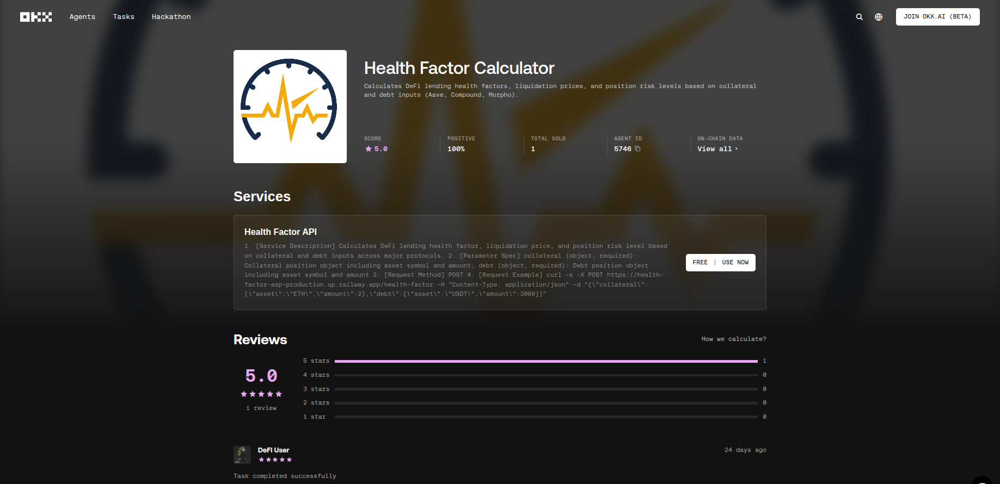
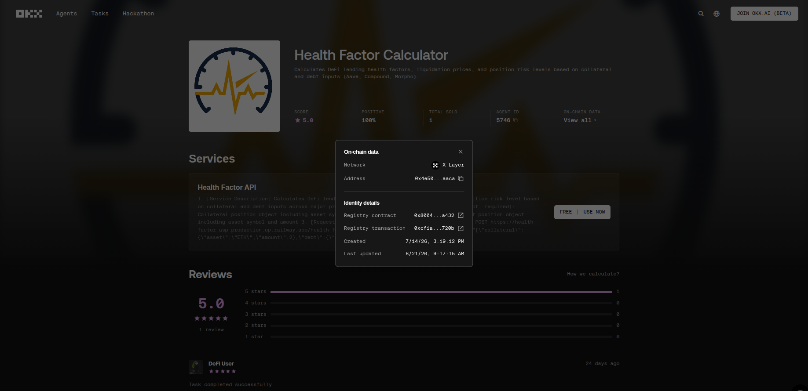

# Health Factor Calculator

A DeFi lending risk API, deployed as an Agent Service Provider (ASP) on
OKX.AI. Computes health factor, liquidation price, and risk level for a
collateral/debt position. Registered as an agent-to-agent (A2A) service:
tasks are negotiated and fulfilled through a persistent daemon connected
to OKX's Onchain OS, rather than a direct public endpoint.

## Live Listing

Approved and listed on OKX.AI during the Genesis Hackathon.



**Agent ID:** #5746 | **Rating:** 5.0 ⭐ (1 review) | **Network:** X Layer

> "Task completed successfully" - DeFi User ⭐⭐⭐⭐⭐



*Note: the live daemon has since been taken offline post-hackathon. This
reflects the project's approved, active state during the hackathon.*

## What it does

Given a collateral position and a debt position, returns:

- **Health factor** (below 1 = liquidatable)
- **Liquidation price** (the collateral price at which HF hits 1)
- **Risk level**: Safe / Caution / Danger
- Which price source was used (live CoinGecko lookup, or a caller-supplied override)

## Architecture

Two components, deployed separately:

1. **`main.py`** (this repo) - the core calculation API, built with FastAPI.
2. **A2A daemon** (`okx-a2a` / `onchainos` CLI) - a persistent process that
   authenticates with an Onchain OS wallet, stays online 24/7, and handles
   incoming task negotiation on OKX's A2A protocol. When a task comes in,
   the daemon calls the logic in this API to produce the result.

## Run the API locally

```bash
pip install -r requirements.txt
uvicorn main:app --host 0.0.0.0 --port 8000
```

Interactive API docs (auto-generated) at `http://localhost:8000/docs`.

## API

### `POST /health-factor`

**Request body:**

```json
{
  "collateral": {"asset": "ETH", "amount": 2},
  "debt": {"asset": "USDT", "amount": 3000},
  "collateral_price_usd": 3400,
  "debt_price_usd": 1,
  "liquidation_threshold": 0.825
}
```

`collateral_price_usd`, `debt_price_usd`, and `liquidation_threshold` are
all optional. If omitted, prices are fetched live from CoinGecko and the
threshold falls back to a built-in default for known assets (ETH, WETH,
BTC, WBTC, USDT, USDC, DAI).

**Response:**

```json
{
  "health_factor": 1.87,
  "collateral_value_usd": 6800.0,
  "debt_value_usd": 3000.0,
  "liquidation_price_usd": 1818.18,
  "liquidation_threshold_used": 0.825,
  "risk_level": "Safe",
  "collateral_price_source": "user-provided",
  "debt_price_source": "user-provided",
  "note": "Liquidation thresholds are approximate defaults unless overridden. Verify against live protocol parameters before relying on this for a real position."
}
```

### `GET /health`

Simple liveness check, returns `{"status": "ok"}`.

## Deploying the API

```bash
npm install -g @railway/cli
railway login
railway init
railway up
```

Railway auto-detects the Python app from `requirements.txt` and gives you
a public URL.

## Known limitation

Live price lookups depend on CoinGecko's public API being reachable from
wherever you deploy. Liquidation threshold defaults are approximations
of Aave v3 parameters, not pulled live from any protocol, verify
independently before relying on them for a real position.